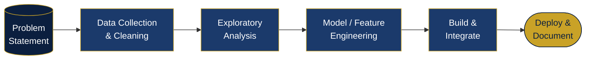
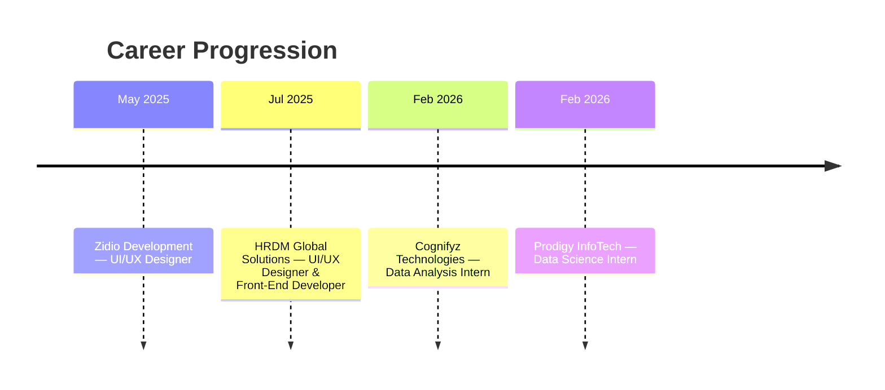

 

<!-- ============== SNAPSHOT ============== -->
## Professional Snapshot

| | |
|---|---|
| **Focus Areas** | Artificial Intelligence · Machine Learning · Data Analysis · Big Data · Full-Stack Development |
| **Current Role** | UI/UX Designer & Front-End Developer, HRDM Global Solutions |
| **Education** | MSc Information Technology, GLS University (2025 – 2027) |
| **Location** | Ahmedabad, Gujarat, India |
| **Availability** | Open to Full-Time & Internship Opportunities |
| **Contact** | vishvbhavsar2004@gmail.com |

<!-- ============== KPI DASHBOARD ============== -->
## At a Glance

<table>
<tr>
<td align="center" width="20%">
 
<b>100K+</b> Records Analyzed
</td>
<td align="center" width="20%">
 
<b>40+</b> Certifications & Cloud Badges
</td>
<td align="center" width="20%">
 
<b>4</b> Industry Internships
</td>
<td align="center" width="20%">
 
<b>1</b> Flagship Product in Development
</td>
<td align="center" width="20%">
 
<b>5+</b> Production-Ready Projects
</td>
</tr>
</table>

<!-- ============== ABOUT ============== -->
## About

I build at the intersection of software engineering, applied AI, and data systems. My work spans full-stack web development, exploratory and statistical data analysis, and machine learning — with a growing focus on large-scale data processing and applied GenAI.

- **Currently building:** SmartSpend / Spendlytics, a full-scale expense management and analytics platform
- **Currently researching:** LLM architectures, NLP pipelines, and distributed data systems (Spark/Hadoop)
- **Core competencies:** Data pipelines, predictive modeling, dashboarding, and responsive web application development
- **Objective:** Apply AI and data engineering practices to solve measurable business problems

<!-- ============== TECH STACK ============== -->
## Technical Skills

**Programming Languages**
 

**Artificial Intelligence & Machine Learning**
 

**Big Data & Databases**
 

**Data Analysis & Business Intelligence**
 

**Web Development & Infrastructure**
 

<!-- ============== PROFICIENCY + FOCUS ============== -->
## Skill Proficiency & Focus Distribution

<table width="100%">
<tr>
<td width="55%" valign="top">

<b>Core Skill Proficiency</b> 

</td>
<td width="45%" valign="top">

<b>Domain Focus Distribution</b> 

</td>
</tr>
</table>

<!-- ============== WORKFLOW ============== -->
## Project Methodology

<!-- ============== EXPERIENCE ============== -->
## Professional Experience

<table width="100%">
<tr><th align="left">Role</th><th align="left">Organization</th><th align="left">Duration</th><th align="left">Impact</th></tr>
<tr>
<td valign="top"><b>UI/UX Designer & Front-End Developer</b></td>
<td valign="top">HRDM Global Solutions</td>
<td valign="top">Jul 2025 – Present</td>
<td valign="top">Designing end-to-end web architectures with Django and JavaScript; delivering accessible, responsive, production-grade dashboards</td>
</tr>
<tr>
<td valign="top"><b>Data Analysis Intern</b></td>
<td valign="top">Cognifyz Technologies</td>
<td valign="top">Feb – Mar 2026</td>
<td valign="top">Conducted exploratory data analysis across multi-variable food datasets; extracted pricing, geospatial, and rating trends using Pandas, Seaborn & Matplotlib</td>
</tr>
<tr>
<td valign="top"><b>Data Science Intern</b></td>
<td valign="top">Prodigy InfoTech</td>
<td valign="top">Feb 2026</td>
<td valign="top">Processed 100K+ records using regression, decision trees, and classification pipelines; built sentiment analysis models using TF-IDF and Logistic Regression</td>
</tr>
<tr>
<td valign="top"><b>UI/UX Designer</b></td>
<td valign="top">Zidio Development</td>
<td valign="top">May – Jul 2025</td>
<td valign="top">Designed interactive wireframes, component libraries, and polished product prototypes</td>
</tr>
</table>

<!-- ============== PROJECTS ============== -->
## Featured Projects

<table width="100%">
<tr>
<td width="50%" valign="top">

### SmartSpend / Spendlytics
**Active Development · Flagship Project**

Full-scale expense management and financial analytics platform delivering real-time spending insights, budget tracking, and data visualization.

`Django` `Python` `Chart.js` `SQL` `Bootstrap`

</td>
<td width="50%" valign="top">

### AI E-Learning Analytics Platform
**Machine Learning Application**

Monitors student engagement, predicts drop-off points, and delivers adaptive, data-driven educational insights.

`Python` `Scikit-Learn` `Pandas` `Streamlit`

</td>
</tr>
<tr>
<td width="50%" valign="top">

### Cognifyz Restaurant EDA
**Data Analytics Case Study**

Comprehensive exploratory analysis uncovering pricing patterns, rating distributions, and delivery logistics drivers across a multi-variable dataset.

`Python` `Pandas` `NumPy` `Seaborn`
 [View Repository →](#)

</td>
<td width="50%" valign="top">

### Prodigy Data Science Suite
**Predictive Modeling & NLP**

End-to-end predictive modeling pipeline handling 100K+ entries for sentiment classification and customer behavior prediction.

`TF-IDF` `Logistic Regression` `NLP`
 [View Repository →](#)

</td>
</tr>
<tr>
<td width="50%" valign="top" colspan="2" align="center">

### Personal Portfolio Platform
**Live Web Platform**

Interactive personal portfolio with modern aesthetics, an interactive certificate gallery, and dynamic dark mode.

`HTML5` `CSS3` `JavaScript` `GitHub Pages`
 [Visit Live Site →](https://vishv05.github.io/) &nbsp;·&nbsp; [Source Code →](#)

</td>
</tr>
</table>

<!-- ============== CERTIFICATIONS ============== -->
## Certifications & Achievements

 

 

  

<!-- ============== EDUCATION ============== -->
## Education

<table width="100%">
<tr>
<td width="15%" align="center">🎓</td>
<td width="85%">
<b>MSc Information Technology</b> — GLS University  
2025 – 2027 · Coursework: AI & Machine Learning, Data Structures & Algorithms, Cloud Computing, Database Management
</td>
</tr>
</table>

<!-- ============== GITHUB ANALYTICS ============== -->
## GitHub Analytics

<b>View GitHub Trophies</b>

 

<!-- ============== CONNECT ============== -->
## Contact

Open to full-time roles, internships, and collaborations in AI/ML, data engineering, and software development.

