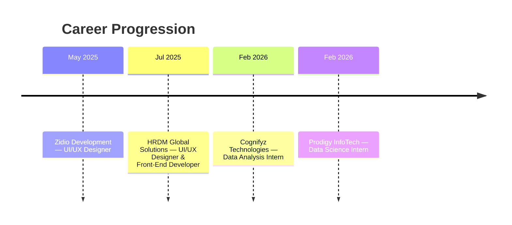

 

<!-- ============== RECRUITER SNAPSHOT ============== -->
## 📋 Quick Snapshot

| | |
|---|---|
| 🎓 **Education** | MSc IT, GLS University (2025 – 2027) |
| 📍 **Location** | Ahmedabad, Gujarat, India |
| 💼 **Status** | Open to Internships & Entry-Level Roles |
| 🧭 **Interest Areas** | Artificial Intelligence · Data Analysis · Big Data · Software Development |
| 📫 **Email** | vishvbhavsar2004@gmail.com |
| 🔗 **Portfolio** | [vishv05.github.io](https://vishv05.github.io/) |

<!-- ============== KPI DASHBOARD ============== -->
## 📊 At a Glance

<table>
<tr>
<td align="center" width="20%">
 
<b>MSc IT</b> 2025 – 2027
</td>
<td align="center" width="20%">
 
<b>AI / ML</b> Core Focus Area
</td>
<td align="center" width="20%">
 
<b>40+</b> Certifications & Badges
</td>
<td align="center" width="20%">
 
<b>100K+</b> Records Processed
</td>
<td align="center" width="20%">
 
<b>4</b> Internships Completed
</td>
</tr>
</table>

<!-- ============== ABOUT ============== -->
## 🧑‍💻 About Me

I'm an IT postgraduate student deeply curious about how **artificial intelligence, large-scale data, and clean engineering** come together to build real products. I enjoy going end-to-end — from writing an ETL pipeline, to training a model, to shipping a working dashboard someone can actually use.

- 🔭 **Currently Building:** SmartSpend / Spendlytics — an intelligent expense analytics platform
- 🧠 **Currently Exploring:** LLM architectures, NLP pipelines, and distributed/Big Data systems
- 📚 **Academic Focus:** AI & Machine Learning, Data Structures & Algorithms, Cloud Computing, Databases
- 🎯 **Goal:** Land a role where I can apply AI and data engineering to solve real business problems
- ⚡ **Fun fact:** 36+ Google Cloud Skill Badges earned chasing rabbit holes on weekends

<!-- ============== ICON GRID: TECH STACK ============== -->
## 🛠️ Tech Stack

**Coding Languages**
 

**AI, ML & GenAI**
 

**Big Data & Databases**
 

**Data Analysis & BI**
 

**Web, Cloud & Tools**
 

<!-- ============== CHARTS: PROFICIENCY + INTEREST RADAR ============== -->
## 📈 Skill Proficiency & Interest Areas

<table width="100%">
<tr>
<td width="55%" valign="top">

<b>Core Skill Proficiency</b> 

</td>
<td width="45%" valign="top">

<b>Where My Interest Lies</b> 

</td>
</tr>
</table>

<!-- ============== MERMAID: LEARNING/PROJECT WORKFLOW ============== -->
## 🔄 How I Build a Project

<!-- ============== EXPERIENCE TIMELINE ============== -->
## 💼 Experience Timeline

<b>📄 Full experience details</b>

 

| Role | Organization | Duration | Impact |
|---|---|---|---|
| UI/UX Designer & Front-End Developer | HRDM Global Solutions | Jul 2025 – Present | Designing end-to-end web architectures with Django + JS; shipping accessible, responsive dashboards |
| Data Analysis Intern | Cognifyz Technologies | Feb – Mar 2026 | Ran EDA across multi-variable food datasets; surfaced pricing & geospatial trends via Pandas/Seaborn |
| Data Science Intern | Prodigy InfoTech | Feb 2026 | Processed 100K+ records with regression/classification pipelines; built sentiment models with TF-IDF |
| UI/UX Designer | Zidio Development | May – Jul 2025 | Designed wireframes, component libraries, and product prototypes |

<!-- ============== PROJECT CARDS ============== -->
## 🚀 Featured Projects

<table width="100%">
<tr>
<td width="50%" valign="top">

### 💰 SmartSpend / Spendlytics
**🟢 Active Development · ⭐ Flagship**

Full-scale expense management & analytics platform with real-time dashboards, budget tracking, and automated expense categorization.

`Django` `Python` `Chart.js` `SQL` `Bootstrap`

</td>
<td width="50%" valign="top">

### 🤖 AI E-Learning Analytics Platform
**⚡ Machine Learning Experiment**

Monitors student engagement, predicts drop-off points, and delivers adaptive, data-driven educational insights.

`Python` `Scikit-Learn` `Pandas` `Streamlit`

</td>
</tr>
<tr>
<td width="50%" valign="top">

### 🍽️ Cognifyz Restaurant EDA
**📊 Data Analytics Case Study**

Exploratory analysis uncovering pricing patterns, rating distributions, and delivery logistics drivers.

`Python` `Pandas` `NumPy` `Seaborn`
 [View Repository →](#)

</td>
<td width="50%" valign="top">

### 🧠 Prodigy Data Science Suite
**🧪 Predictive Modeling & NLP**

End-to-end pipeline over 100K+ entries for sentiment classification and behavior prediction.

`TF-IDF` `Logistic Regression` `NLP`
 [View Repository →](#)

</td>
</tr>
<tr>
<td width="50%" valign="top" colspan="2" align="center">

### 🌐 Personal Portfolio Platform
**🚀 Live Web Platform**

Interactive personal portfolio with an interactive certificate gallery and dynamic dark mode.

`HTML5` `CSS3` `JavaScript` `GitHub Pages`
 [Visit Live Site →](https://vishv05.github.io/) &nbsp;·&nbsp; [Source Code →](#)

</td>
</tr>
</table>

More experiments live in my pinned repositories — scripts, automations, and ML notebooks.
 
<a href="https://github.com/Vishv05?tab=repositories"><b>View All Repositories →</b></a>

<!-- ============== CERTIFICATIONS ============== -->
## 🏅 Certifications & Achievements

 

 

  

<!-- ============== EDUCATION ============== -->
## 🎓 Education

<table width="100%">
<tr>
<td width="15%" align="center">🎓</td>
<td width="85%">
<b>MSc Information Technology</b> — GLS University  
2025 – 2027 · Coursework: AI & Machine Learning, Data Structures & Algorithms, Cloud Computing, Database Management
</td>
</tr>
</table>

<!-- ============== GITHUB STAT WIDGETS ============== -->
## 📈 GitHub Analytics

<b>🏆 View GitHub Trophies</b>

 

<!-- ============== CONNECT ============== -->
## 🤝 Let's Connect

Open to **AI/ML internships**, **data analysis roles**, and **software development opportunities** — always happy to talk tech.

  

<i>Curious about technology. Passionate about building. Always learning.</i>

