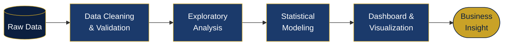
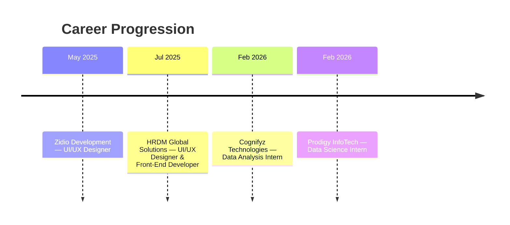

  

<!-- ============== KPI DASHBOARD ============== -->
## At a Glance

<table>
<tr>
<td align="center" width="20%">
 
<b>MSc IT</b> GLS University · 2025–27
</td>
<td align="center" width="20%">
 
<b>4</b> Data / Analytics Internships
</td>
<td align="center" width="20%">
 
<b>40+</b> Certifications & Cloud Badges
</td>
<td align="center" width="20%">
 
<b>100K+</b> Records Analyzed
</td>
<td align="center" width="20%">
 
<b>1</b> Flagship Analytics Platform
</td>
</tr>
</table>

<!-- ============== ICON GRID: CORE TOOLKIT ============== -->
## Core Data Analyst Toolkit

**Querying & Spreadsheets**
 

**BI & Visualization**
 

**Analysis & Cloud**
 

<!-- ============== CHART: TOOL PROFICIENCY ============== -->
## Tool Proficiency

<!-- ============== MERMAID: ANALYTICS WORKFLOW ============== -->
## How I Approach a Data Problem

<!-- ============== MERMAID: EXPERIENCE TIMELINE ============== -->
## Experience Timeline

<b>Full experience details</b>

 

| Role | Organization | Duration | Impact |
|---|---|---|---|
| UI/UX Designer & Front-End Developer | HRDM Global Solutions | Jul 2025 – Present | Designed end-to-end web architectures with Django + JS; shipped accessible, responsive dashboards |
| Data Analysis Intern | Cognifyz Technologies | Feb – Mar 2026 | Ran EDA across multi-variable food datasets; surfaced pricing & geospatial trends via Pandas/Seaborn |
| Data Science Intern | Prodigy InfoTech | Feb 2026 | Processed 100K+ records with regression/classification pipelines; built sentiment models with TF-IDF |
| UI/UX Designer | Zidio Development | May – Jul 2025 | Designed wireframes, component libraries, and product prototypes |

<!-- ============== BADGE WALL + DONUT: CERTIFICATIONS ============== -->
## Certifications & Achievements

 

 

  

<!-- ============== PROJECT CARDS ============== -->
## Featured Projects

<table width="100%">
<tr>
<td width="50%" valign="top">

### 📊 SmartSpend / Spendlytics
**Active Development · Flagship Project**

Full-scale expense management & analytics platform — real-time spend dashboards, budget tracking, and automated categorization built for actionable financial insight.

`Django` `Python` `Chart.js` `SQL` `Bootstrap`

</td>
<td width="50%" valign="top">

### 🤖 AI E-Learning Analytics Platform
**Machine Learning Experiment**

Monitors student engagement metrics, predicts drop-off points, and surfaces adaptive insights from behavioral data.

`Python` `Scikit-Learn` `Pandas` `Streamlit`

</td>
</tr>
<tr>
<td width="50%" valign="top">

### 🍽️ Cognifyz Restaurant EDA
**Data Analytics Case Study**

Full exploratory analysis uncovering pricing patterns, rating distributions, and delivery logistics drivers across a multi-variable dataset.

`Python` `Pandas` `NumPy` `Seaborn`
 [View Repository →](#)

</td>
<td width="50%" valign="top">

### 🧠 Prodigy Data Science Suite
**Predictive Modeling & NLP**

End-to-end pipeline over 100K+ entries for sentiment classification and customer behavior prediction.

`TF-IDF` `Logistic Regression` `NLP`
 [View Repository →](#)

</td>
</tr>
</table>

<!-- ============== GITHUB STAT WIDGETS ============== -->
## GitHub Analytics

<b>View GitHub Trophies</b>

 

## Let's Connect

Open to Data Analyst roles, analytics collaborations, and dashboard/BI projects.

  

<i>Curious about technology. Passionate about building. Always learning.</i>

